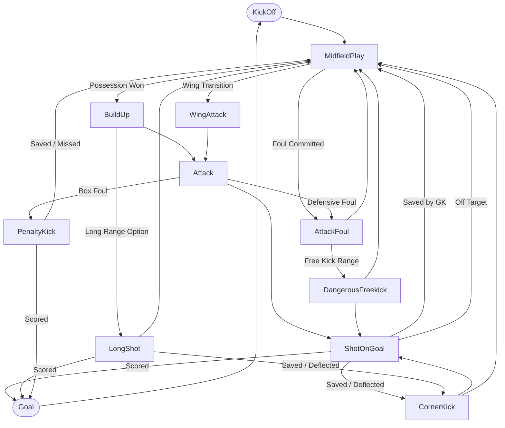

# ⚽ MatchSimulator — Advanced Football Engine & League Management System

[](https://www.python.org/downloads/)
[](https://fastapi.tiangolo.com)
[](https://www.sqlalchemy.org/)
[](https://pytest.org)
[](LICENSE)
[](https://github.com/psf/black)

A realistic, event-driven football (soccer) simulation engine and league management platform built with **Python**, **FastAPI**, and **Vanilla JavaScript**. MatchSimulator combines a Finite State Machine (FSM) match engine, dynamic player attribute weighting, live Server-Sent Events (SSE) streaming, automated league fixture generation, intelligent Team of the Week (TOTW) curation, and real-world squad web-scraping capabilities into an interactive web experience.

---

## 🌟 Key Features

### 🎮 High-Fidelity Match Simulation Engine
* **Finite State Machine (FSM) Architecture**: Simulates realistic football phases including `KickOff`, `MidfieldPlay`, `BuildUp`, `WingAttack`, `LongShot`, `Attack`, `ShotOnGoal`, `CornerKick`, `AttackFoul`, `PenaltyKick`, and `DangerousFreekick`.
* **Deep Attribute-Driven Mechanics**: Match calculations factor in player pace, shooting, passing, dribbling, defending, physicality, stamina degradation, and goalkeeper metrics (reflexes, diving, handling, positioning).
* **Position Flexibility & Smart Fallbacks**: Tactical fallback algorithms adapt player effectiveness when deployed outside natural roles.
* **Dynamic In-Game Events**: Realistic simulation of goals, assists, yellow/red cards, tactical fouls, injuries, forced/tactical substitutions, and stoppage time.
* **Live Performance Ratings & MOTM**: Real-time rating algorithm (1.0–10.0 scale) tracking every action, dynamically electing the **Man of the Match (MOTM)**.

### 🏆 Full League & Tournament System
* **Round-Robin Fixture Engine**: Generates single or double round-robin schedules for custom leagues of up to 64 teams.
* **Instant & Live Match Execution**: Simulate entire matchdays in one click or follow individual fixtures in real time.
* **Live Standings Table**: Automatic calculation of points, goal differences, head-to-head records, and form streaks.
* **Season Analytics & Golden Boot Race**: Comprehensive leaderboards for top scorers, assist leaders, clean sheets, and average player ratings.

### 🌟 Team of the Week (TOTW) & Team of the Season (TOTS)
* **Intelligent Lineup Selector**: Dynamically selects the best 11 starters and bench players per round or across an entire campaign.
* **Tactical Formation Adaptability**: Render TOTW/TOTS in various tactical formations (`4-3-3`, `4-4-2`, `3-5-2`, `4-2-3-1`, `5-3-2`, etc.) with role-specific rating optimizations.

### 👤 Detailed Player Profiles & Radar Analytics
* **FIFA / EA FC Style Attributes**: Detailed ratings breakdown across Physical, Technical, and Tactical categories (or Goalkeeping stats).
* **Historical Match Logs**: Complete match-by-match breakdown featuring minutes played, ratings, goals, assists, cards, substitutions, and MOTM honors.
* **Smart Fuzzy Search**: Accent-insensitive, multi-field player search across leagues, clubs, and active matches.

### ⚡ Real-Time Streaming & Interactive Web UI
* **Server-Sent Events (SSE)**: Ultra-low latency `/match/stream` endpoint delivering tick-by-tick simulation updates to the client.
* **Dynamic Commentary Engine**: Multi-variant, context-aware match commentator describing game highlights in natural language.
* **Modern Dark-Mode Pitch UI**: Interactive pitch visualizations with player cards, stamina gauges, live scoreboards, match timeline feeds, and tactical formation views.

### 🕷️ Automated Data Scraping & Database Management
* **Built-in SoFIFA Scraper**: Extraction pipeline for real-world teams, tactical formations, player ratings, nationalities, and historical data.
* **SQLAlchemy 2.0 ORM**: Clean relational data model with SQLite database, automated migrations, and JSON seeders.

---

## 🏛️ System Architecture

```
                                  ┌────────────────────────┐
                                  │   Web Browser (UI)     │
                                  │  (Vanilla JS / CSS3)   │
                                  └───────────▲────────────┘
                                              │ HTTP / SSE Stream
                                  ┌───────────▼────────────┐
                                  │   FastAPI Web Server   │
                                  │    (api/ & main.py)    │
                                  └───────────▲────────────┘
                                              │
                      ┌───────────────────────┴───────────────────────┐
                      │                                               │
           ┌──────────▼──────────┐                         ┌──────────▼──────────┐
           │     MatchEngine     │                         │    LeagueEngine     │
           │  (FSM State Flow)   │                         │(Fixtures, Standings)│
           └──────────▲──────────┘                         └──────────▲──────────┘
                      │                                               │
           ┌──────────▼──────────┐                         ┌──────────▼──────────┐
           │      EventBus       │◄─────── RatingTracker   │  TeamOfTheRound     │
           │   & Commentator     │◄─────── StatsTracker    │   (TOTW / TOTS)     │
           └─────────────────────┘                         └─────────────────────┘
                      │
           ┌──────────▼──────────────────────────┐
           │     Database & Storage Layer        │
           │ (SQLAlchemy ORM + SQLite + JSON DB) │
           └─────────────────────────────────────┘
```

### Match Simulation State Machine Flow



---

## 📂 Project Structure

```
new_matchsimulator/
├── api/
│   └── schemas.py              # Pydantic v2 request/response validation schemas
├── data/
│   ├── data.json               # Seed team and player database
│   ├── players.json            # Scraped player dataset
│   ├── teams.json              # Scraped team dataset
│   └── match_simulator.db      # SQLite relational database
├── scrapper/
│   ├── fetcher.py              # HTTP request fetcher with retry logic
│   ├── players.py              # Player profile and stats scraper
│   ├── teams.py                # Team rosters and formation scraper
│   └── run_all.py              # Automated CLI scraping pipeline
├── src/
│   ├── db/
│   │   ├── database.py         # SQLAlchemy Base & ORM database models
│   │   ├── loader.py           # JSON and SQLite data loaders
│   │   ├── mappers.py          # Data mappers between ORM and domain models
│   │   ├── migrate.py          # Automated database schema migration
│   │   └── seeder.py           # Database seeder from scraped JSON data
│   ├── engine/
│   │   ├── engine.py           # Core FSM MatchEngine, Match, and State classes
│   │   ├── league_engine.py    # League fixture generator and round simulator
│   │   └── team_of_the_round.py# TOTW and TOTS tactical lineup algorithms
│   ├── events/
│   │   ├── commentator.py      # Real-time multi-scenario commentary generator
│   │   ├── event_bus.py        # Publish/Subscribe EventBus for decoupled events
│   │   ├── events.py           # Match event definitions (Goals, Cards, Subs, etc.)
│   │   ├── rating_tracker.py   # In-game real-time player rating tracker
│   │   └── stats_tracker.py    # Per-match team statistics accumulator
│   ├── models/
│   │   └── models.py           # Domain models (Player, Team, MatchPlayer, League)
│   └── repositories/
│       └── team_repository.py  # Repository layer for database operations
├── static/
│   ├── js/
│   │   ├── helpers.js          # UI utilities, notifications, and formatting
│   │   ├── league.js           # League management, table, and fixture logic
│   │   ├── match.js            # Single match setup, stream handling, and pitch UI
│   │   ├── player-profile.js   # Player profile modal and radar analytics
│   │   ├── setup.js            # Team and formation selection handlers
│   │   ├── stats.js            # Match statistics rendering
│   │   └── totw.js             # Team of the Week pitch renderer
│   ├── app.js                  # Main frontend SPA coordinator
│   ├── index.html              # Single-page application entry point
│   └── style.css               # Comprehensive design system & responsive styling
├── tests/
│   ├── test_api.py             # FastAPI endpoint integration tests
│   ├── test_db.py              # Database ORM and migration tests
│   ├── test_engine.py          # FSM simulation engine unit tests
│   ├── test_event_bus.py       # EventBus pub/sub tests
│   ├── test_league_engine.py   # League scheduling and simulation tests
│   ├── test_models.py          # Domain model logic and attribute tests
│   ├── test_player_profile.py  # Player profile search and statistics tests
│   ├── test_player_season_stats.py # Season stats aggregation tests
│   ├── test_rating_tracker.py  # Dynamic player rating calculation tests
│   ├── test_stream_api.py      # SSE stream integration tests
│   ├── test_team_of_the_round.py # TOTW/TOTS selection algorithm tests
│   └── test_team_repository.py # Team repository tests
├── main.py                     # FastAPI application entry point & routes
├── requirements.txt            # Python dependencies
└── README.md                   # Project documentation
```

---

## 🚀 Getting Started

### Prerequisites
* **Python 3.10+** (Python 3.11 or 3.12 recommended)
* **Git**

### Installation

1. **Clone the repository**:
   ```bash
   git clone https://github.com/your-username/match-simulator.git
   cd match-simulator
   ```

2. **Create and activate a virtual environment**:
   * **Windows (PowerShell)**:
     ```powershell
     python -m venv .venv
     .venv\Scripts\Activate.ps1
     ```
   * **Linux / macOS**:
     ```bash
     python3 -m venv .venv
     source .venv/bin/activate
     ```

3. **Install dependencies**:
   ```bash
   pip install -r requirements.txt
   ```

4. **Initialize the Database**:
   The database migrations and initial seed data load automatically upon application startup. To manually run migrations:
   ```bash
   python -m src.db.migrate
   ```

---

## 💻 Running the Application

### Start the Web Server
Launch the FastAPI development server with Uvicorn:

```bash
uvicorn main:app --reload --host 127.0.0.1 --port 8000
```

### Accessing the Interfaces
* **Interactive Web Application**: [http://127.0.0.1:8000](http://127.0.0.1:8000)
* **Interactive API Documentation (Swagger UI)**: [http://127.0.0.1:8000/docs](http://127.0.0.1:8000/docs)
* **Alternative API Documentation (ReDoc)**: [http://127.0.0.1:8000/redoc](http://127.0.0.1:8000/redoc)

---

## 🌐 API Overview

| Method | Endpoint | Description |
|---|---|---|
| `GET` | `/` | Serves the web UI single-page application |
| `GET` | `/match/options` | Returns available teams, formations, and leagues |
| `POST` | `/match/start` | Initializes a single match with custom teams and formations |
| `GET` | `/match/status` | Returns the current match score, time, events, and stats |
| `POST` | `/match/tick` | Advances the match simulation by one discrete tick (15s) |
| `GET` | `/match/stream` | Server-Sent Events (SSE) stream for real-time match updates |
| `GET` | `/match/stats` | Retrieves detailed team and player statistics for the active match |
| `POST` | `/league/start` | Generates a new league tournament and fixture schedule |
| `GET` | `/league/table` | Returns the current league table, fixtures, and player stats |
| `POST` | `/league/match/status` | Instantly simulates a specific league fixture |
| `POST` | `/league/match/live_start`| Sets up a league fixture for live SSE simulation |
| `GET` | `/league/player-stats` | Returns sorted league player leaderboards (goals, assists, rating) |
| `GET` | `/league/team-of-the-week` | Generates the Team of the Week for a given round |
| `GET` | `/league/team-of-the-season` | Generates the Team of the Season across all played rounds |
| `GET` | `/player/profile` | Returns full player analytics, attributes, and match history |

---

## 🕷️ Scraping Fresh Data

The built-in scraping module allows you to extract the latest teams, tactics, and player attributes directly from SoFIFA:

```bash
# Scrape all teams and their full squads
python -m scrapper.run_all

# Scrape a specific number of team pages (e.g. top 60 teams)
python -m scrapper.run_all --teams-pages 1 --max-teams 20
```

The scraper outputs structured JSON files to `data/teams.json` and `data/players.json`, which can be imported into the relational database.

---

## 🧪 Testing

The project includes an extensive test suite covering the simulation engine, event bus, rating algorithms, league generator, database models, and API endpoints.

To run the complete test suite:

```bash
pytest
```

To run with verbose output and test execution timings:

```bash
pytest -v --durations=10
```

To run a specific test module:

```bash
pytest tests/test_engine.py
pytest tests/test_team_of_the_round.py
```

---

## ⚙️ Supported Formations & Tactics

The engine natively supports standard and custom football formations with dynamic positional mappings:

* **4-3-3** (Standard balanced attacking setup)
* **4-4-2** (Classic double-striker system)
* **4-2-3-1** (Double-pivot midfield with central attacking midfielder)
* **3-5-2** (Three center-backs with dynamic wing-backs)
* **3-4-3** (Aggressive wide attacking structure)
* **5-3-2** (Defensively solid five-at-the-back setup)
* **4-1-2-1-2 (Diamond)** (Narrow midfield with dedicated CDM and CAM)

---

## 🛠️ Technology Stack

* **Backend**: [Python 3.10+](https://www.python.org/), [FastAPI](https://fastapi.tiangolo.com/), [Pydantic v2](https://docs.pydantic.dev/), [Uvicorn](https://www.uvicorn.org/)
* **Database & ORM**: [SQLAlchemy 2.0](https://www.sqlalchemy.org/), [SQLite](https://www.sqlite.org/)
* **Web Scraping**: [Requests](https://requests.readthedocs.io/), [BeautifulSoup4](https://www.crummy.com/software/BeautifulSoup/)
* **Frontend**: HTML5, CSS3 (Modern Glassmorphism & Custom Properties), Vanilla JavaScript (ES6+ Modules, SSE EventSource)
* **Testing & Quality**: [Pytest](https://pytest.org/)

---

## 📄 License

This project is licensed under the MIT License — see the [LICENSE](LICENSE) file for details.